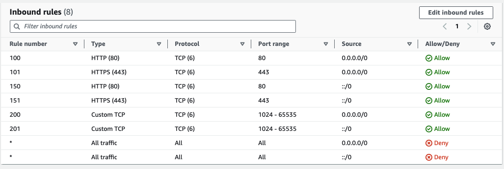
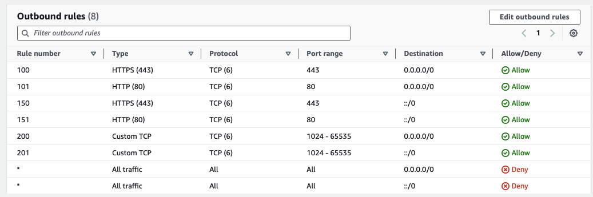
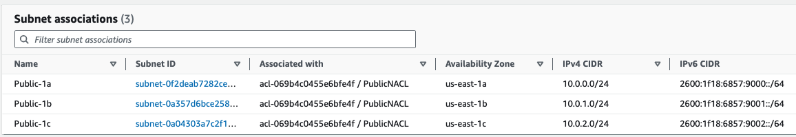
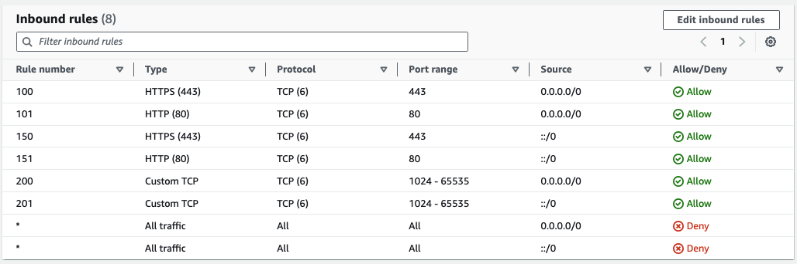
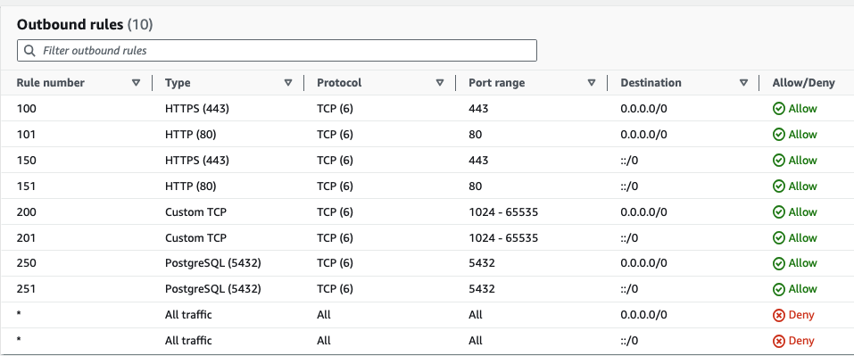
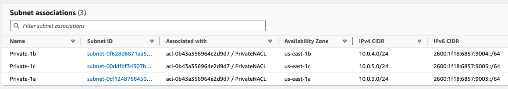

# classic-3tier-app-architecture
Visual Representation of a 3-Tier Application Architecture on AWS

### Public Tier - AWS Application Load Balancer (ALB) running in a Public Subnet, can be reached from the internet

### Application Tier - EC2 instances or ASG running in a Private Subnet, but can initiate outbound connection to the internet, but not reachable from the Internet

### DataStore Tier - A PostgreSQL running in a Private Subnet, All traffic in this subnet is completely local to the VPC

.jpeg)

### Subnet & Instance Level Security - NACLs & Security Groups
***NACLs (Firewalls for the entire subnet) - Applied to the entire subnet, for packets to reach our EC2 instances they have to be explicitly allowed by the NACL, then further filtered by the Security Groups at the instance level.***

NACLs are Stateless - they don’t remember TCP sessions, they don’t recognize a response as being a response to a request that came in earlier, so ingress & egress rules must be specified. Default NACLS allows all * traffic. You can also create Allow or Deny rules, Specify the Protocol, Source/destination IP range, and the Source/destination Port range

### Create three different NACLs, one for the private subnet & the other for the Public Subnet & Database Subnet
By Default all ingress & egress traffic to newly created NACLs are denied, we have to explicitly create allow rules

### Create Public Subnet NACL rules:
Allow IPv4/6 ingress traffic on Port 80 & 443 from the internet (0.0.0.0/0 & ::/0)
Allow ephemeral Ports 1024-65535 in, so that NAT instance in the Public Subnet can receive IPv4 response to request it sent out

### Inbound Public NACL rules

### Outbound Public NACL rules
Ephemeral Ports 1024-65535 (egress) have to be opened for IPV4/6 - 0.0.0.0/0 & ::/0, so the response can be sent to the end-users
Open Port 80/443 so the NAT can send outbound IPv4 traffic - 0.0.0.0/0

### Create Private Subnet NACL rules:

### Inbound Private NACL rules

In order for EC2 instances to receive traffic from the Database Subnet you need to open ingress ephemeral Ports 1024-65535 for IPv4/6 traffic - 0.0.0.0/0, ::/0
Also, allow inbound IPv4/6 traffic on ports 443 and 80

### Outbound Private NACL rules
In order to send traffic to the Database Subnet Allow outbound traffic on Port 5432 for IPv4/6

### Create Database NACL rules 

### Inbound Database NACL rules
Allow Ingress 5432 for local VPC traffic, so EC2 instances in the Private Subnet can communicate to the database

### Outbound Database NACL rules
In order for the database to send responses ephemeral Ports 1024-65535 need to be opened outbound for local VPC traffic

### Security Groups - are applied directly to the instances, security groups are stateful, they do recognize sessions
We can specify just ingress rules, you can only specify allow rules, no deny rules, all inbound traffic is denied by default and all outbound is allowed. Specify Protocol and source IP/Port range

### Create Three Security Groups - DatabaseSG, WebServerSG, AlbSG

### AlbSG
Allow inbound TCP on Port 80/443 from the Internet - 0.0.0.0/0 & ::/0
Allow outbound ephemeral Ports 1024-65535 to the WebServer Security Group
Hardwire this load balancer to only communicate with the WebServers Security Group

### WebServerSG
Only allowed to receive ephemeral Ports 1024 - 65535 from the ALB SG

### DatabaseSG
Allow inbound 5432 from only the WebserverSG (Using security group references)
